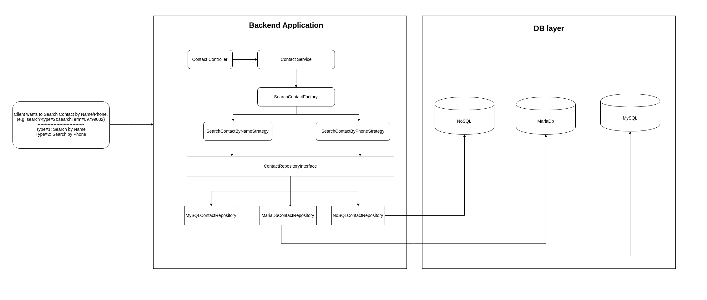

## Laravel 5.8 example ##

* `Mô tả yêu cầu`: Khác hàng muốn có tính năng tìm kiếm `Contact` theo `Name` hoăc `Phone`.
(Trong tương lai có thể có thêm các loại tìm kiếm khác: Tìm kiếm Company theo `Name` hoặc `Email` hoặc `Address`...)

* Đây chỉ là project mang tính demo làm trong khoảng 3h, nên sẽ có phần code đang đánh @todo vì tác giả mong muốn người xem tập trung nhiều vào phần Design.

* Vui lòng liên hệ skype: `pckhien` nếu như có bất cứ câu hỏi nào. Xin cảm ơn.  

### Design ###

### Một vài Pattern được sử dụng ###

* `Repository Pattern`: https://deviq.com/repository-pattern/
* `Factory Pattern`: https://www.tutorialspoint.com/design_pattern/factory_pattern.htm
* `Strategy Pattern`: https://sourcemaking.com/design_patterns/strategy

### Installation ###

* `git clone git@github.com:mbvb1223/laravel-example.git`
* `cd projectname`
* `composer install`
* `php artisan key:generate`
* `Create a database and inform *.env*`
* `php artisan migrate --seed` to create and populate tables
* `php artisan serve` to start the app on http://localhost:8001/

### Run Test cases ###

* `./vendor/bin/phpunit`

### Example endpoints ###

* `Search by Name:` http://localhost:8001/api/contacts/search?type=1&searchTerm=a

* `Search by Phone:` http://localhost:8001/api/contacts/search?type=2&searchTerm=0979903200

